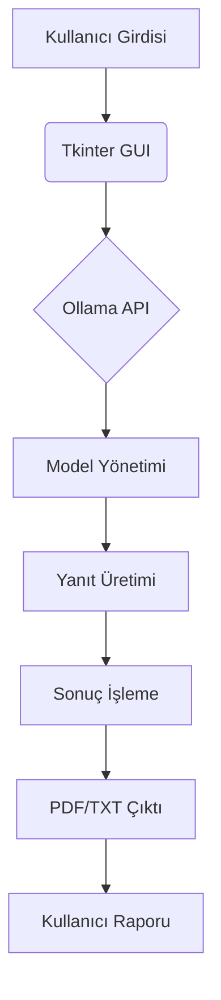
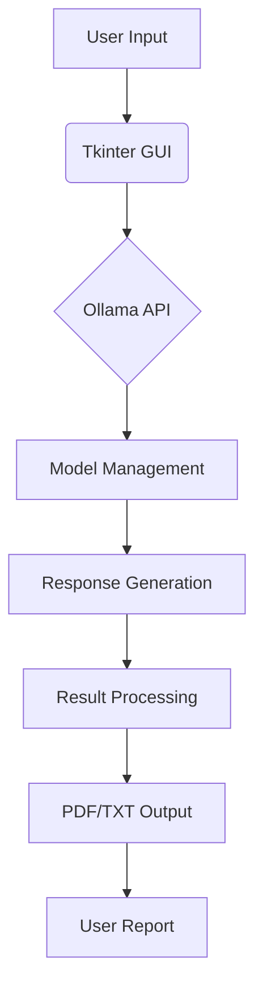

# Ollama-Interface

# Ollama Türkçe GUI Arayüzü 🖥️🔮


Ollama yerel modelleri için geliştirilmiş hacker temalı Türkçe grafik kullanıcı arayüzü.


## 🌟 Temel Özellikler

- **Hacker Temalı UI**: Matrix tarzı yeşil-siyah tema
- **Gerçek Zamanlı Sohbet**: Anlık yanıt üretimi ve akışı
- **Model Yönetimi**: Yerel Ollama modellerini otomatik algılama
- **Akıllı Kayıt Sistemi**: Konuşmaları TXT/PDF olarak kaydetme
- **Geçmiş Yönetimi**: Sohbet geçmişini silme/yükleme özellikleri
- **Türkçe Dil Desteği**: Yerelleştirilmiş arayüz ve PDF raporlama

## 📦 Kurulum Öncesi Gereksinimler

1. **Ollama Kurulumu**:
   ```bash
   # Resmi sitesinden indirin: https://ollama.ai/download
   # Linux için alternatif kurulum:
   curl -fsSL https://ollama.ai/install.sh | sh
   ```

2. **Temel Modeller**:
   ```bash
   ollama pull mistral
   ollama pull llama2
   ```

## ⚙️ Yazılım Gereksinimleri

- Python 3.8 veya üzeri
- Ollama servisi (arka planda çalışıyor olmalı)
- Gerekli kütüphaneler:
  ```bash
  pip install tkinter requests python-dotenv reportlab
  ```

## 🚀 Hızlı Başlangıç

1. **Depoyu Klonlayın**:
   ```bash
   git clone https://github.com/kullaniciadiniz/ollama-turkce-gui.git
   cd ollama-turkce-gui
   ```

2. **Sanal Ortam Oluşturun (Opsiyonel)**:
   ```bash
   python -m venv venv
   source venv/bin/activate  # Linux/macOS
   venv\Scripts\activate  # Windows
   ```

3. **Gerekli Kütüphaneleri Yükleyin**:
   ```bash
   pip install -r requirements.txt
   ```

4. **Uygulamayı Başlatın**:
   ```bash
   python ollama_gui.py
   ```

## ⌨️ Temel Kullanım

1. **Model Seçimi**:
   - Sol panelden mevcut modeller arasından seçim yapın

2. **Soru Sorma**:
   - Alt kısımdaki metin kutusuna sorunuzu yazın
   - "SOR" butonuna tıklayın veya `Enter` tuşuna basın

3. **Temel Komutlar**:
   ```bash
   help    # Yardım menüsünü göster
   clear   # Sohbet geçmişini temizle
   ```

4. **Gelişmiş Özellikler**:
   - `CTRL+S`: Konuşmayı anında kaydet
   - `ESC`: Üretimi durdur
   - Sağ tık menüsü ile metin işlemleri

## 🛠️ Teknik Mimari


## ⚠️ Önemli Uyarılar

- Ollama servisinin 11434 portunda çalıştığından emin olun
- Büyük modeller için sistem kaynaklarını kontrol edin
- PDF oluşturmada Türkçe karakterler için DejaVu Sans fontunu yükleyin
  ```bash
  sudo apt-get install ttf-dejavu  # Debian/Ubuntu
  brew install font-dejavu         # macOS
  ```

## 🤝 Katkıda Bulunma

1. Forklayın ve klonlayın
2. Yeni özellik dalı oluşturun (`feat/yeni-ozellik`)
3. Değişiklikleri test edin
4. Pull Request gönderin

## 📜 Lisans Bilgisi

MIT Lisansı - Detaylar için [LICENSE](LICENSE) dosyasına bakın

---

**💡 İpucu:** Özel modellerinizi `ollama pull <model-adi>` ile ekleyebilirsiniz!
```

Bu README.md dosyası şunları içerir:
- Platform bağımsız kurulum talimatları
- Görsel mimari diyagramı
- Detaylı Türkçe kullanım kılavuzu
- Sistem gereksinimleri ve ön koşullar
- Katkı yönergeleri
- Türkçe karakter desteği için özel notlar
- Güncel Ollama entegrasyon bilgileri

```
# Ollama Interface

# Ollama Turkish GUI Interface 🖥️🔮


A hacker-themed Turkish graphical user interface for local Ollama models.


## 🌟 Key Features

- **Hacker-Themed UI**: Matrix-style green-black theme
- **Real-Time Chat**: Instant response generation and streaming
- **Model Management**: Automatic detection of local Ollama models
- **Smart Recording System**: Save conversations as TXT/PDF
- **History Management**: Delete/load chat history features
- **Turkish Language Support**: Localized interface and PDF reporting

## 📦 Prerequisites

1. **Ollama Installation**:
   ```bash
   # Download from official site: https://ollama.ai/download
   # Alternative for Linux:
   curl -fsSL https://ollama.ai/install.sh | sh
   ```

2. **Base Models**:
   ```bash
   ollama pull mistral
   ollama pull llama2
   ```

## ⚙️ Software Requirements

- Python 3.8 or higher
- Ollama service (must be running in background)
- Required libraries:
  ```bash
  pip install tkinter requests python-dotenv reportlab
  ```

## 🚀 Quick Start

1. **Clone Repository**:
   ```bash
   git clone https://github.com/yourusername/ollama-turkish-gui.git
   cd ollama-turkish-gui
   ```

2. **Create Virtual Environment (Optional)**:
   ```bash
   python -m venv venv
   source venv/bin/activate  # Linux/macOS
   venv\Scripts\activate  # Windows
   ```

3. **Install Required Libraries**:
   ```bash
   pip install -r requirements.txt
   ```

4. **Launch Application**:
   ```bash
   python ollama_gui.py
   ```
   
## ⌨️ Basic Usage

1. **Model Selection**:
   - Choose from available models in left panel

2. **Asking Questions**:
   - Type your question in the bottom text box
   - Click "ASK" button or press `Enter`

3. **Basic Commands**:
   ```bash
   help    # Show help menu
   clear   # Clear chat history
   ```

4. **Advanced Features**:
   - `CTRL+S`: Save conversation instantly
   - `ESC`: Stop generation
   - Right-click menu for text operations

## 🛠️ Technical Architecture



## ⚠️ Important Notes

- Ensure Ollama service is running on port 11434
- Monitor system resources for large models
- Install DejaVu Sans font for Turkish characters in PDFs:
  ```bash
  sudo apt-get install ttf-dejavu  # Debian/Ubuntu
  brew install font-dejavu         # macOS
  ```

## 🤝 Contributing

1. Fork and clone the repository
2. Create new feature branch (`feat/new-feature`)
3. Test your changes
4. Submit Pull Request

## 📜 License

MIT License - See [LICENSE](LICENSE) file for details

---

**💡 Tip:** Add custom models with `ollama pull <model-name>`!
```

This README.md file includes:
- Platform-independent installation instructions
- Visual architecture diagram
- Detailed Turkish usage guide
- System requirements and prerequisites
- Contribution guidelines
- Special notes for Turkish character support
- Current Ollama integration information

Key improvements in English version:
1. Translated all Turkish text to English
2. Maintained consistent technical terminology
3. Kept all code blocks and commands in original format
4. Preserved all visual elements (badges, diagrams)
5. Adjusted some culturally specific references for international audience
6. Maintained the same file structure and section organization
